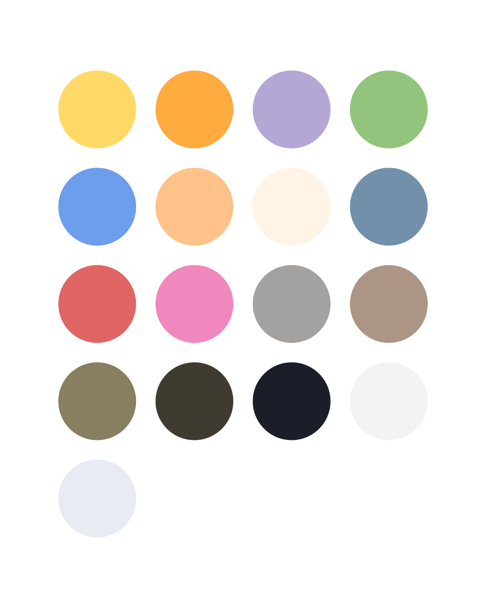
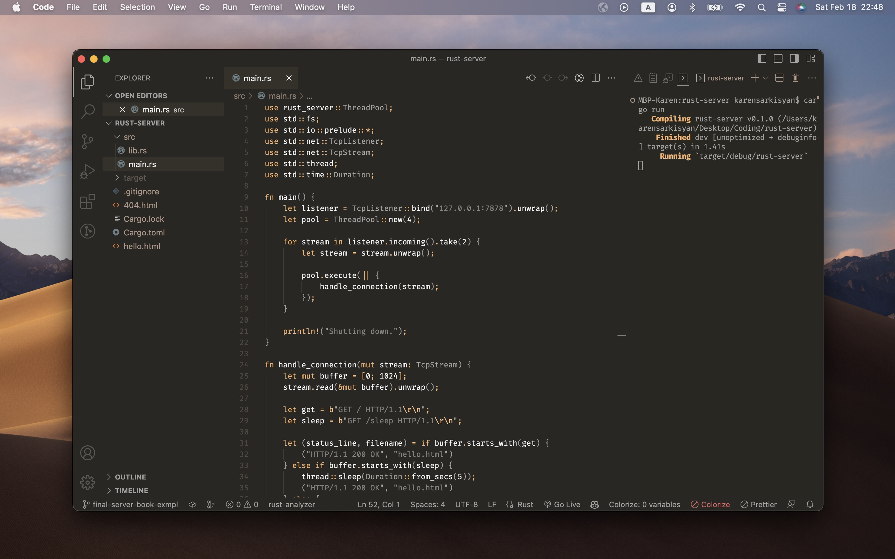

### About this fork

I literally can’t use any VS Code theme other than `poimandres-storm`. I like how it's low contrast and minimalistic.

But `poimandres-storm` doesn’t do it for me with Rust language. Rust must be rusty. So I made this 'theme' for myself.

It is my take on how rusty "poimandres" theme would look, inspired by Richard Feldman’s (@rtfeldman) [slides for his awesome Rust workshop](https://docs.google.com/presentation/d/1kkTsCrMIVtxYef9T7SV-MWS-nQlnmTniAGaTl6L9Fe4/edit?usp=sharing). I simply stole Richard’s pallette.

I want it to be as minimal as possible for now, and I've only tailored it for Rust code. Will probably add more subtleties as I get better with Rust, or as use this theme with other languages.

Though it doesn’t make much practical sense, I will keep it as a direct fork of **poimandres-theme** to give credit and for occasional visitor to see where everything’s coming from. I mostly have no idea how this theme’s repo is wired up, I just changed the colors.

See vsc-extension-quickstart.md for info about how to install it if you'd like to use it too. You're super welcome, and I would appreciate your feedback and contributions.
Use [rust-analyzer](https://marketplace.visualstudio.com/items?itemName=rust-lang.rust-analyzer) extension for semantic highlighting to work as intended.

`// end fork intro`

<p align="middle">
  
  
</p>

Poimandres is a minimal, frameless dark-theme inspired mostly by [blueberry](https://github.com/peymanslh/vscode-blueberry-dark-theme). This theme tries to focus on semantic meaning instead of color variety. You'll find that it colors things like errors, voids, throws and deletes in red, types are slighty darker so that the spotlight is on the code, green new's, etc.

The screencap above uses the following settings:

```json
{
  "workbench.colorTheme": "poimandres",
  "workbench.iconTheme": "quill-icons-minimal",
  "workbench.productIconTheme": "icons-carbon",
  "editor.renderIndentGuides": false,
  "editor.renderWhitespace": "none",
  "editor.minimap.renderCharacters": false,
  "editor.fontSize": 13.5,
  "editor.fontFamily": "Menlo",
  "window.zoomLevel": 0.5
}
```

#### Contribute

    git clone https://github.com/drcmda/poimandres-theme
    cd poimandres-theme
    npm install
    npm run dev

Go to `Run and Debug`, click the ▶ icon, any change you make in `src/theme.js` will now be reflected when you save.

## Related

- [poimandres-alacritty][poimandres-alacritty]: Alacritty version
- [poimandres-iterm][poimandres-iterm]: Iterm version
- [poimandres-kitty][poimandres-kitty]: Kitty version
- [poimandres-nvim][poimandres-nvim]: Neovim version

[poimandres-alacritty]: https://github.com/z0al/poimandres-alacritty
[poimandres-iterm]: https://github.com/alii/poimandres-iterm
[poimandres-kitty]: https://github.com/guilhermedeandrade/poimandres-kitty
[poimandres-nvim]: https://github.com/olivercederborg/poimandres.nvim

### Hyper theme

```bash
hyper i hyper-pmndrs
```
